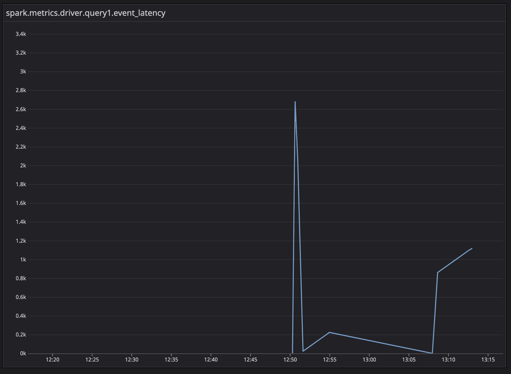

## Databricks custom metrics examples


This repository collects examples of working with custom metrics in Spark on Databricks, in particular:

* Adding custom metrics in Scala
* Reporting these custom metrics from Scala and Python
* Exposing these metrics in Ganglia
* Exposing these metrics in Datadog 
* Exposing these metrics in Azure Log Analytics

Please note that in these examples only the job clusters are covered.

### Local development setup

Versions:
* Maven 3.8.3
* Java 1.8
* Python 3.7
* Spark 3.1.2


Python setup:
```
conda create --name dbx_metrics_examples python=3.7
conda activate dbx_metrics_examples
pip install -r unit-requirements.txt
pip install -e .
```

### Metric naming convention 

In this example, custom metric name contains of the following elements:
```
{metric_namespace_name}.driver.{metric_name}.{gauge_name}
```
Where components are the following:
* `metric_namespace_name` is taken from `spark.metrics.namespace` conf parameter. 
Please note that this parameter shall be set before the start of the Spark Session. In the Datadog integration, we set this parameter during the init script.
* `metric_name` is a property set when initializing the `MetricReporter` class in Python.
* `gauge_name` is a property set when initializing the `MetricReporter` class in Python.

### Metrics exposure in Ganglia

After launching the sample job in Python, you can go to the cluster metrics section and search for "latency" metric:


### Metrics exposure in Datadog


In this example a customized init script is used to capture the customized metrics. We're using statsd sink and then consume statsd metrics in Datadog Agent.

1. Add Datadog API Key:
```
databricks secrets create-scope --scope=datadog
databricks secrets put --scope=datadog --key=apiKey --string-value=... # better to read from the file for better security
```
2. Configure the init-script (`scripts/datadog-integration.sh`) and env variables. `conf/deployment.json` contains an example configuration.

3. You can analyse these metrics in Datadog by searching for `spark.metrics.driver.{metric_name}.{gauge_name}`, for example:




### Metrics exposure in Azure Log Analytics

1. Add Azure Log Analytics credentials:
```
databricks secrets create-scope --scope=logAnalytics
databricks secrets put --scope=logAnalytics --key=workspaceId --string-value=...
databricks secrets put --scope=logAnalytics --key=workspaceKey --string-value=... 
```

2. Configure the Log Analytics directory:
```
databricks fs mkdirs dbfs:/databricks/spark-monitoring
```

3. Package the Azure Monitoring Library:
```
make package-azure-monitoring
```

4. Upload jars and init script to DBFS:
```
databricks fs cp scripts/azure-log-analytics-integration.sh dbfs:/databricks/spark-monitoring/azure-log-analytics-integration.sh
databricks fs cp \
    --overwrite --recursive \
    tools/azure-monitoring/generated
    dbfs:/databricks/spark-monitoring/
```

After launching the job, check the Azure Log Analytics workspace for the metric:

