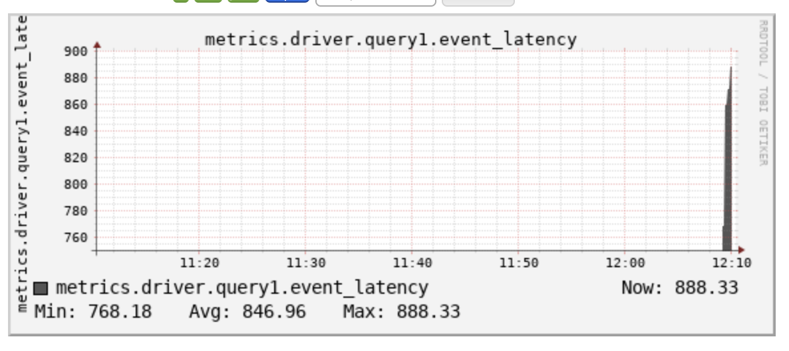

## Databricks metrics examples


This repository collects examples of working with custom metrics in Spark on Databricks, in particular:

* Adding custom metrics in Scala
* Reporting these custom metrics from Scala and Python
* Visualizing these metrics in Datadog 

### Local development setup

Versions:
* Maven 3.8.3
* Java 1.8
* Python 3.7
* Spark 3.1.2


Python setup:
```
conda create --name dbx_metrics_examples python=3.7
conda activate dbx_metrics_examples
```

### Metric naming convention 

In this example, custom metric name contains of the following elements:
```
f"{metric_namespace_name}.driver.{metric_name}.{gauge_name}"
```
Where components are the following:
* `metric_namespace_name` is taken from `spark.metrics.namespace` conf parameter. 
Please note that this parameter shall be set before the start of the Spark Session. In the Datadog integration, we set this parameter during the init script.
* `metric_name` is a property set when initializing the `MetricReporter` class.
* `gauge_name` is a property set when initializing the `MetricReporter` class.

### Metrics exposure in Ganglia

After launching the sample job in Python, you can go to the cluster metrics section and search for "latency" metric:




### Reporting metrics to Datadog 


In this example a customized init script is used. Main issue with official integration is that it doesn't include custom metrics. 

1. Add Datadog API Key:
```
databricks secrets create-scope --scope=datadog
databricks secrets put --scope=datadog --key=apiKey --string-value=... # better to read from the file for better security
```

2. Configure the init-script (`scripts/datadog-integration.sh`) and env variables. `conf/deployment.json` contains an example configuration.

3. 
